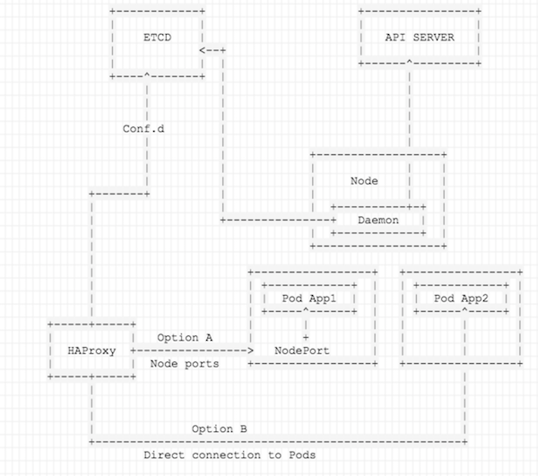

# kube2lb
poc to generte load balancer conf from the kube api

The idea behind this PoC is to create a gateway for a kubernetes cluster. there are different ways to handle public traffic in kubernetes depending on the cloud provider that you use, but when there's no such thing as a cloud provider, we have to find a different way of sending traffic into our cluster.

In  this case, we're going to create an external HAProxy that will send traffic to the cluster. Configuration is done via ETCD and Conf.d to prevent too much coupling and provide an easy way to extend teh PoC.

There are 2 ways of configuring the HA proxy:

* Using Node ports:
* Using direct access to pods

The following diagram illustrates the concept:

Node ports are not ideal because the connection arrives to the HAproxy, that sends it to one of the nodes, and the kube-proxy redirects the traffic to the right node/pod using a service. This is basically the model that ELBs follow.

If throughtput is important, it's much better to put flannel in the HAProxy box and configure the routng directly to the pods that match the selector. This option has the inconvenience of having to configure flannel in the box where the HAProxy lives.
